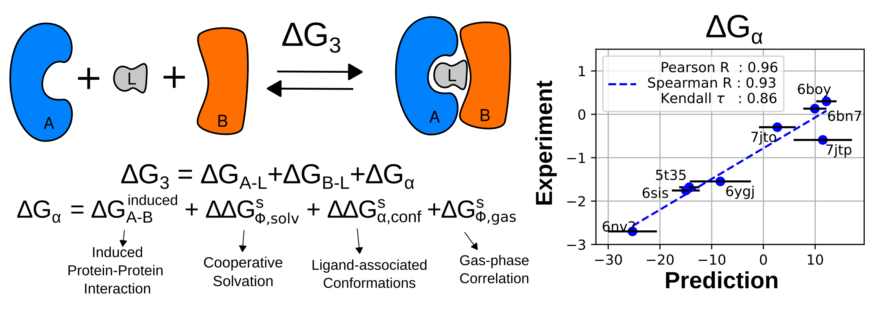

# Cooperative Free Energy
This repo is used to generate the Figures for the publication: Cooperative Free Energy: Induced Protein-Protein Interaction, Cooperative Solvation, and Ligand Conformation in Protein-Ligand-Protein Ternary Complexes

doi: TBD

 

# Figures
Figure1, Figure2, and Figure S1 are generated from `simulation.ipynb`

Plots in Figure4 are generated from `Analysis.ipynb`

# Simulation input files
All inputs for amber simulations are stored in the "./systems" folder.  

./systems/ALB_pdbds/  stores the pdb files for the proteins (`PDBID_A.pdb` and `PDBID_B.pdb`) 

./systems/ALB_pdbs/special_residues/ stores the parameters for special residues CSO and SEP used in PDB 6nv2 

./systems/ALB_pdbs/Lignads/ stores the parameter for the ligand using antechamber with GAFF2 and AM1-BCC charges 

## Preparing Amber input files
Topology and Initial structure preparations: running `./systems/ALB_pdbs/prepare.sh` prepares all simulation with a fix size with 0.15M NaCl. The box size and salt concentration can be changed by modifying the python template files in ALB_pdbs/template/

## Running simulations
Go to ./systems/ and run ``'bash multi_md.sh'`` to get the trajectories

## MMPB(GB)/SA Analysis
Input files MMPB(GB)/SA calculations are stored in ./systems/endpoint/

running `/systems/endpoint/multi.sh` can split the topology and trajectories into 7 parts, including A, B, L, AL, BL, AB, and ALB. 

running `./systems/endpoint/mmpbsa/multi.sh` calculates the MMPBSA energy of each state in each trajectories

running `./systems/endpoint/mmgbsa/multi.sh` calculates the MMGBSA energy of each state in each trajectories

MMPB(GB)/SA with Nwat variant can be calculated in a similar manner but the trajectories and topologies are split using the function "split_with_n_water" function `./systems/prepare_functions.sh`

The standard output files are too large (>6GB in total), only the transformed numpy format is stored in the repo.

EX: 
```bash
split_with_n_water 10 ${Ae[$i_name]} ${Bs[$i_name]} ${Be[$i_name]} ${L[$i_name]} $path $name'_ALB_'$ENV $name"
```
takes the closest 10 water molecules as part of protein A.
